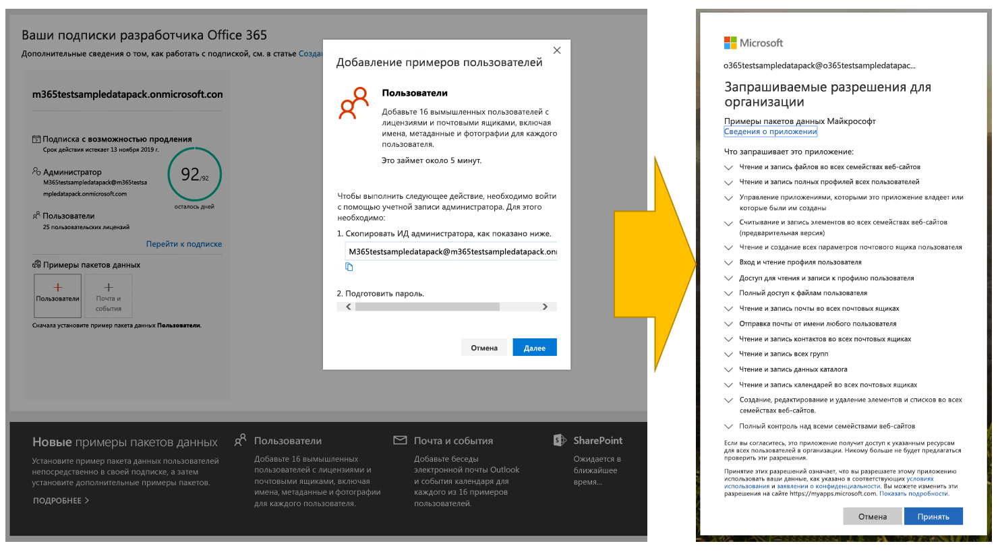
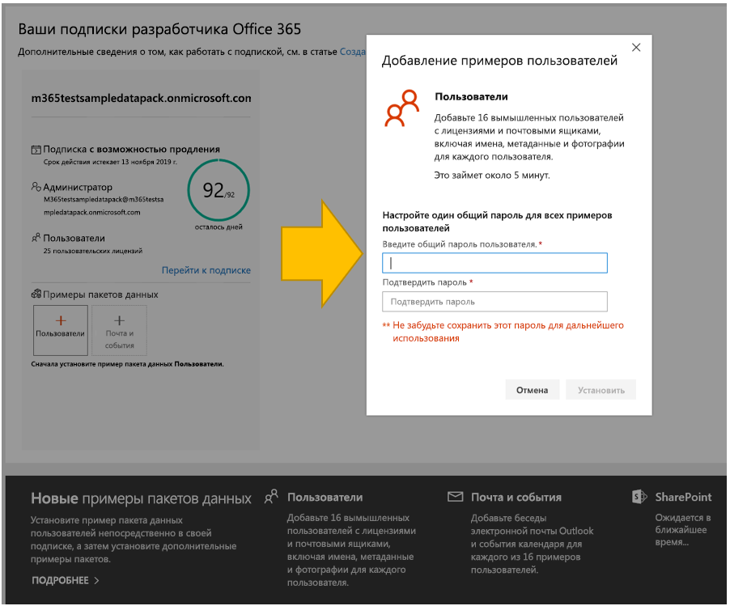
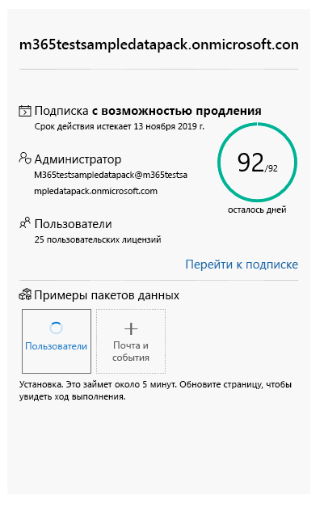
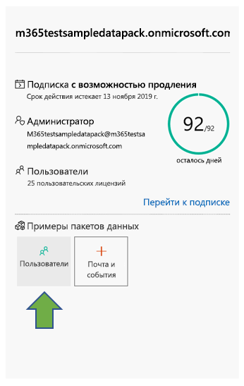
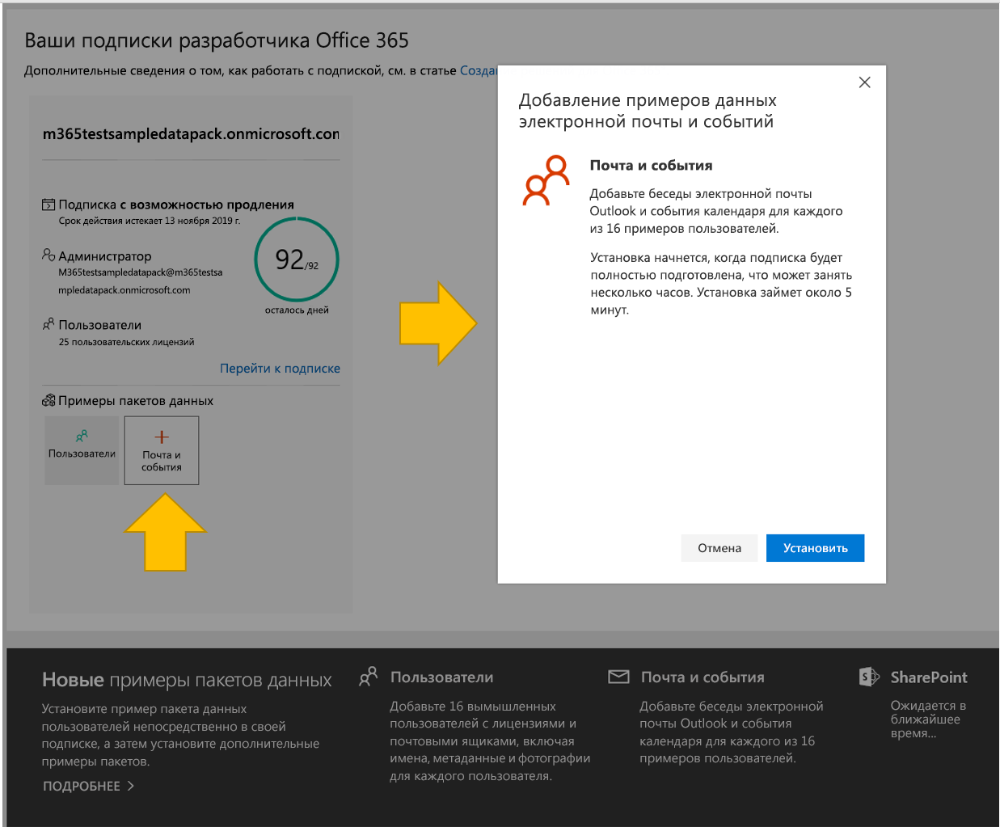
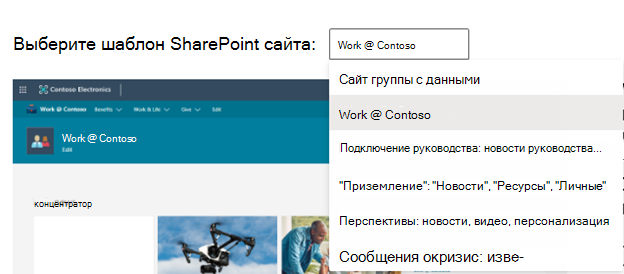
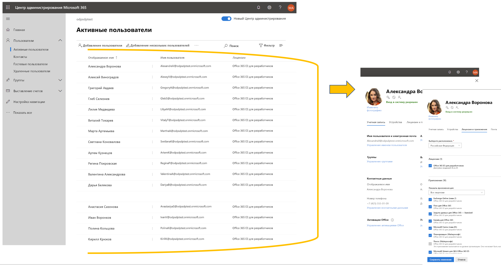
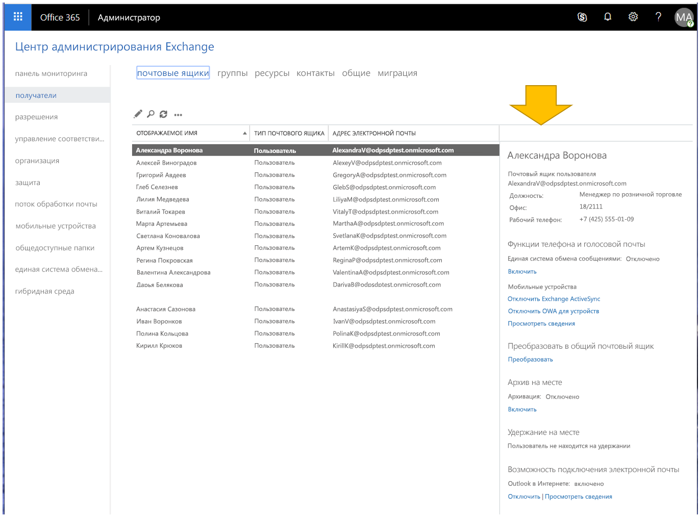

# Образец данных песочницы для разработчиков

Подписка на песочницу Программы для разработчиков Microsoft 365 включает образцы данных, чтобы сэкономить ваше время, предоставляя все необходимые данные и содержимое для сборки и тестирования ваших решений.

Если у вас есть песочница с мгновенным запуском, примеры пакетов данных уже предустановлены. В вашей песочнице с мгновенным запуском содержатся следующие образцы данных:

- **Данные календаря, почты и пользователей Microsoft Graph** — 16 примеров пользователей с пользовательскими данными и содержимым для моделирования решений. К ним относятся почтовые ящики пользователей, события календаря и интеграция в среду разработчика Teams с имитацией чатов и участия в командах.
- Пример **пакета данных Teams** со следующей настраиваемой средой разработчика:
  - Предварительно настроенная **загрузка неопубликованного приложения**
  - **Пять примеров команд, каналов, вкладок и сеансов чатов,** созданных на основе 16 примеров пользователей.
  - **Предварительно установленный и закрепленный портал разработчика Teams / App Studio** для упрощения создания манифеста приложения Teams и пакета приложений, а также редактор карточек и библиотека элементов управления React.
    
    
- **Пример данных SharePoint Framework** — выбирайте из шести шаблонов, которые можно установить и оценить в качестве настраиваемых решений для организации (с одним предустановленным).

Если у вас есть настраиваемая песочница, вы можете быстро установить образцы данных, чтобы не тратить время на их создание, а сосредоточиться на своих решениях.

> [!NOTE] 
> Вы не можете установить примеры пакетов данных в другие подписки на Microsoft 365. Эти примеры пакетов данных совместимы только с подпиской на песочницу для разработчика Microsoft 365, предоставляемой в рамках программы для разработчиков Microsoft 365.

## Установка примеров пакетов данных в настраиваемой песочнице

Примеры пакетов данных можно найти на [панели мониторинга программы для разработчиков Microsoft 365](https://developer.microsoft.com/microsoft-365/profile) в нижней части плитки подписки.

В настоящее время доступны следующие примеры пакетов данных.

- Пользователи. Устанавливает 16 вымышленных пользователей с лицензиями, почтовыми ящиками и метаданными, включая имена и фотографии для каждого пользователя. Используйте API Microsoft Graph для работы с примерами данных пользователей следующим образом:
  - Получение сведений об определенном пользователе
  - Обновление пользователя
  - Получение подчиненных
  - Подготовка организационной диаграммы  
  - Получение пользователей по отделам

- Почта и события. Добавляет беседы электронной почты Outlook и события календаря для каждого из 16 примеров пользователей. Используйте API Microsoft Graph для работы с примерами данных почты и событий следующим образом:
  - Получение сообщений электронной почты для пользователей
  - Получение сообщений электронной почты, отфильтрованных по дате
  - Получение предстоящих событий
  - Обновление и удаление предстоящих событий

  > [!NOTE]
  > Перед установкой примера данных "Почта и события" требуется установить пример пакета данных "Пользователи".
    
- Пример данных SharePoint Framework — выбирайте из шести шаблонов, которые можно установить и оценить в качестве настраиваемых решений для организации (с одним предустановленным).

### Установка примера пакета данных "Пользователи"

Перед установкой примера пакета данных "Пользователи" убедитесь в наличии подписки разработчика на Microsoft 365 и назначьте для себя лицензию администратора.

> [!NOTE]
> Убедитесь, что в вашей подписке доступно 16 пользователей. Ваша подписка включает 25 пользователей. Если вы уже настроили более 10 пользователей, сначала удалите некоторых из них, чтобы обеспечить успешную установку.

Чтобы установить пример пакета данных "Пользователи":

1. Выберите поле **Пользователи** внизу плитки подписки.
2. Скопируйте идентификатор администратора. Он потребуется для входа в вашу подписку.
3. Введите идентификатор администратора и пароль на странице входа.
4. Дайте согласие на получение доступа в качестве администратора подписки разработчика на Microsoft 365.

  

5. Настройте пароли для всех пользователей из примера. Для удобства администрирования всех вымышленных пользователей задайте один общий пароль.

  

6. Будет выполнена установка данных, занимающая около 5 минут.

  

7. После завершения установки вы получите уведомление по электронной почте, а поле на плитке подписки станет зеленым. Теперь вы можете установить пример пакета данных "Почта и события".

  

### Установка примера пакета данных "Почта и события"

После установки примера пакета данных "Пользователи" можно установить пакет данных "Почта и события".

1. На плитке подписки выберите поле **Почта и события**.
2. Нажмите кнопку **Установить**, чтобы начать установку.

  

  > [!NOTE]
  > Если вы только что создали свою подписку, ее требуется полностью подготовить перед началом установки. Это может занять несколько часов. После запуска установка может занять до 20 минут.

3. После завершения установки вы получите уведомление по электронной почте, а поле на плитке подписки станет зеленым.

### Установка примера пакета данных SharePoint

В пример пакета данных SharePoint входят шесть различных шаблонов сайтов SharePoint. Они позволяют пробовать и моделировать различные решения SharePoint для совместной работы, коммуникации, вовлечения и управления знаниями.

Это несколько самых популярных шаблонов из [Наглядного справочника PnP SharePoint](https://provisioning.sharepointpnp.com/). Сегодня очень легко создавать образцы решений для красивых, быстродействующих сайтов и страниц, отлично выглядящих на любом устройстве и на любом экране. Вдохновляйтесь этими образцами или добавьте их в клиент своей песочницы, чтобы приступить к построению следующего сайта.

Эти шаблоны можно установить в вашей подписке. После установки одного шаблона можно по желанию установить другие. Для установки выполните следующие действия.

1. Выберите нужный шаблон в раскрывающемся меню.

  

2. Настройте пользовательские параметры для сайтов или примите значения по умолчанию.
3. Используйте ИД администратора клиента песочницы и пароль для проверки подлинности и выдачи разрешения на установку. 

Установка продолжится автоматически.

>**Примечание.** Подготовка этих шаблонов сайтов поддерживается только в подписках разработчиков Office 365 E3 и Microsoft 365 E5 на английском языке. Все материалы доступны только на английском языке.

#### Какие шаблоны SharePoint доступны?

В пример пакета SharePoint входят семь различных шаблонов.

#### Сайт группы с данными

Шаблон сайта группы с данными содержит несколько списков и библиотек документов, которые автоматически привязаны к сайту группы SharePoint. Это позволяет разрабатывать решения с помощью SharePoint Framework, Power Apps и Microsoft Graph.

Этот шаблон включает в себя следующие данные:

- Список контактов с предварительно заполненными контактами
- Список, заполненный более 6 000 элементами
- Библиотеки документов с примерами документов PowerPoint, Excel, Word и OneNote
- Список событий с элементами объявлений

Этот шаблон интегрируется с примером данных "Пользователи".

#### Работа в Contoso
Шаблон "Работа в Contoso" состоит из нескольких семейств веб-сайтов, автоматически связанных с центральным сайтом для демонстрации всех стандартных функций объединения.

Шаблон содержит следующие структуры и ресурсы:

- Основной набор семейства веб-сайтов в качестве центрального сайта
- Два информационных сайта, связанных с центральным сайтом, — сайты, посвященные преимуществам и благотворительности
- Один групповой сайт команды, связанный с центральным сайтом, — сайт группы
- Примеры новостных статей в семействах дочерних веб-сайтов
- Примеры файлов Word, Excel и PowerPoint
- Пример контента изображений, используемого в семействах веб-сайтов

В семействах дочерних веб-сайтов используются те же шаблоны, которые можно также подготовить отдельно от этой службы.

>**Примечание.** Если этот шаблон применяется поверх существующего сайта для коммуникаций, содержимое страницы приветствия будет перезаписано.

#### Руководители на связи: новости, мероприятия, вовлеченность руководителя

На этом сайте для руководства можно получить представление о целях и приоритетах руководства группы. Контент сайта стимулирует вовлеченность в мероприятия и беседы.

При добавлении этого макета в клиент будет создан следующий контент:

- Пример страницы приветствия с демонстрацией готовых веб-частей
- Примеры новостных статей, демонстрирующие различные современные макеты страниц

Этот шаблон интегрируется с примером данных "Пользователи".

#### Целевая страница: новости, ресурсы, персонализированное содержимое

Этот информационный сайт поможет вашим сотрудникам найти нужные новости и ресурсы, а также персонализированное содержимое, подобранное специально для них.

При добавлении этого макета в клиент будет создан следующий контент:

- Демонстрационная структура для домашнего сайта портала
- Настраиваемая структура страницы приветствия
- 6 дополнительных примеров современных страниц и новостных статей
- Примеры изображений и документов Office

#### Перспектива: новости, видео, персонализированное содержимое

Этот сайт, предназначенный для размещения новостей и персонализированного содержимого, содержит также видеоклипы, способствующие повышению вовлеченности.
При добавлении этого макета в клиент будет создан следующий контент:

- Настраиваемые макеты страницы приветствия
- Пример шаблона страницы для новостных статей
- 12 примеров новостных статей

#### Коммуникации при кризисе: объявления, новости, ресурсы, сообщества и призывы к действию

Держите пользователей в курсе происходящего, вовлекайте их и двигайтесь вперед во время кризисов, от экстремальных погодных явлений до чрезвычайных ситуаций санитарно-эпидемического плана или связанных с безопасностью. Этот шаблон создает центральный ресурс для руководителей и информаторов, позволяющий обмениваться важными новостями и объявлениями; единый источник истинных сведений, позволяющий сотрудникам быть в курсе дел, и место для общения людей в организации.

При добавлении этого макета в клиент будет создан следующий контент:

- Настраиваемая страница приветствия, созданная с помощью веб-части
- 4 новостные статьи с примерами содержимого

Этот шаблон интегрируется с примером данных "Пользователи".

## Можно ли установить примеры пакетов данных в другие подписки на Microsoft 365?

Нет. Эти примеры пакетов данных совместимы только с подпиской разработчика Microsoft 365, предоставляемой в рамках программы для разработчиков Microsoft 365.

## Как просмотреть примеры данных в своей подписке?

Чтобы просмотреть пример данных "Пользователи", перейдите в [**Центр администрирования Microsoft 365**](https://admin.microsoft.com/), используя подписку разработчика на Microsoft 365. В разделе **Пользователи** выберите пункт **Активные пользователи**. Вы увидите список 16 пользователей. Вы можете выбрать пользователя, чтобы просмотреть связанные с ним метаданные, включая фотографии и лицензии.

Чтобы просмотреть пример данных "Почта и события", в [**Центре администрирования Microsoft 365**](/microsoft-365/admin/admin-overview/about-the-admin-center?view=o365-worldwide) выберите команду **Показать все**, а затем выберите пункт **Exchange**. В Центре администрирования Exchange, выбрав пункт **получатели**, можно увидеть, что для каждого из 16 пользователей добавлены почтовые ящики с сообщениями и событиями.

Чтобы просмотреть пример данных Microsoft Teams, перейдите в **Teams**, используя подписку Microsoft 365 E5. На вкладке Teams можно увидеть несколько предварительно созданных команд с чатами образцов пользователей в **Команде проекта Mark 8**. Приложение App Studio/Dev Portal предварительно установлено и закреплено на панели навигации.

Чтобы просмотреть пример данных SharePoint, перейдите в Центр администрирования SharePoint и выберите **Активные сайты** в области навигации слева. Там будут расположены предустановленные образцы сайтов и все дополнительные шаблоны сайтов, которые вы установили в своей песочнице.

## См. также

- [Настройка подписки разработчика Microsoft 365](microsoft-365-developer-program-get-started.md)
