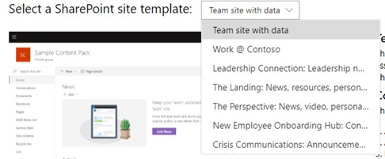

# Использование примеров пакетов данных в подписке программы для разработчиков Microsoft 365Use sample data packs with your Microsoft 365 Developer Program subscription

Вы можете установить примеры пакетов данных в подписке программы для разработчиков Microsoft 365.You can install sample data packs on your Microsoft 365 Developer Program subscription. Примеры пакетов данных позволяют экономить время, автоматически устанавливая данные и содержимое, необходимые для создания и тестирования решений.Sample data packs save you time by automatically installing data and content you need to build and test your solutions. Сюда относятся вымышленные пользователи, метаданные и фотографии для имитации небольшой корпоративной среды.This includes fictitious users, metadata, and photos to simulate a small corporate environment. Вы можете быстро установить пример данных, чтобы не тратить время на их создание, а сосредоточиться на своих решениях.You can quickly install the sample data so that you can focus on your solutions rather than spend time creating sample data yourself.

Примеры пакетов данных можно найти на [панели мониторинга программы для разработчиков Microsoft 365](https://developer.microsoft.com/office/profile) в нижней части плитки подписки.You can find sample data packs on your [Microsoft 365 Developer Program dashboard](https://developer.microsoft.com/office/profile), at the bottom of your subscription tile.

В настоящее время доступны следующие примеры пакетов данных.The following sample data packs are currently available:

- Пользователи. Устанавливает 16 вымышленных пользователей с лицензиями, почтовыми ящиками и метаданными, включая имена и фотографии для каждого пользователя.Users - Installs 16 fictitious users with licenses, mailboxes, and metadata, including names and photos for each user. Используйте API Microsoft Graph для работы с примерами данных пользователей следующим образом:Use Microsoft Graph APIs to work with user sample data in the following ways:
  - Получение сведений об определенном пользователеGet specific user details
  - Обновление пользователяUpdate user
  - Получение подчиненныхGet direct reports
  - Подготовка организационной диаграммыPrepare organization chart  
  - Получение пользователей по отделамGet users by department

- Почта и события. Добавляет беседы электронной почты Outlook и события календаря для каждого из 16 примеров пользователей.Mail and events - Adds Outlook email conversations and calendar events for each of the 16 sample users. Используйте API Microsoft Graph для работы с примерами данных почты и событий следующим образом:Use Microsoft Graph APIs to work with mail and events sample data in the following ways:
  - Получение сообщений электронной почты для пользователейGet emails by users
  - Получение сообщений электронной почты, отфильтрованных по датеGet emails filtered by date
  - Получение предстоящих событийGet upcoming events
  - Обновление и удаление предстоящих событийUpdate/delete upcoming events

> [!NOTE]
> Перед установкой примера данных "Почта и события" требуется установить пример пакета данных "Пользователи".You must install the Users sample data pack before you install Mail and Events.

## Что добавляют примеры пакетов данных в мою подписку?What do the sample data packs add to my subscription?

Пример пакета данных "Пользователи" создает в вашей подписке 16 вымышленных пользователей и добавляет лицензии, а также почтовые ящики, имена, метаданные и фотографии для каждого пользователя.The Users sample data pack creates 16 fictitious users on your subscription, and includes the licenses for each user, and mailboxes, names, metadata, and photos for each.

Пример пакета данных "Почта и события" добавляет беседы электронной почты Outlook и события календаря для каждого из 16 установленных пользователей.The Mail and Events sample data pack adds Outlook email conversations and calendar events for each of the 16 users installed.

## Как установить пример пакета данных "Пользователи"?How do I install the Users sample data pack?

Перед установкой примера пакета данных "Пользователи" убедитесь в наличии подписки разработчика на Microsoft 365 и назначьте для себя лицензию администратора.Before you install the Users sample data pack, make sure that you have a Microsoft 365 developer subscription and that you assign a license to yourself as the admin.

> [!NOTE]
> Убедитесь, что в вашей подписке доступно 16 пользователей.Make sure that you have 16 users available in your subscription. Ваша подписка включает 25 пользователей.Your subscription includes 25 users. Если вы уже настроили более 10 пользователей, сначала удалите некоторых из них, чтобы обеспечить успешную установку.If you have already configured more than 10 users, remove some users first to ensure that your installation is successful.

Чтобы установить пример пакета данных "Пользователи":To install the Users sample data pack:

1. Выберите поле **Пользователи** внизу плитки подписки.Select the **Users** box at the bottom of your subscription tile.
2. Скопируйте идентификатор администратора. Он потребуется для входа в вашу подписку.Copy your administrator ID; you will need it to sign in to your subscription.
3. Введите идентификатор администратора и пароль на странице входа.Enter your administrator ID and password on the sign in page.
4. Дайте согласие на получение доступа в качестве администратора подписки разработчика на Microsoft 365.Consent to the permissions as an administrator of your Microsoft 365 developer subscription.

5. Настройте пароли для всех пользователей из примера.Configure your passwords for all sample users. Для удобства администрирования всех вымышленных пользователей потребуется задать один общий пароль.You will need to have one shared password defined for easy administration of all your fictitious users.

6. Будет выполнена установка данных,The data will be installed. занимающая около 5 минут.The installation should take about 5 minutes.

7. После завершения установки вы получите уведомление по электронной почте, а поле на плитке подписки станет зеленым.When installation is finished, you'll be notified by email, and the box on your subscription tile will be green. Теперь вы можете установить пример пакета данных "Почта и события".You can now install the Mail and Events sample data pack.

## Как установить пример пакета данных "Почта и события"?How do I install the Mail and Events sample data pack?

После установки примера пакета данных "Пользователи" можно установить пакет данных "Почта и события".After you've installed the Users sample data pack, you can install mail and events.

1. На плитке подписки выберите поле **Почта и события**.Choose the **Mail &amp; Events** box on your subscription tile.
2. Нажмите кнопку **Установить**, чтобы начать установку.Select **Install** to begin installation.

> [!NOTE]
> Если вы только что создали свою подписку, ее требуется полностью подготовить перед началом установки.If you just created your subscription, it must be fully provisioned before installation can begin. Это может занять несколько часов.This can take up to a few hours. После запуска установка может занять до 20 минут.After installation starts, it can take up to 20 minutes to finish.

3. После завершения установки вы получите уведомление по электронной почте, а поле на плитке подписки станет зеленым.When installation is finished, you'll be notified by email, and the box on your subscription tile will be green.

## Как установить пример пакета данных SharePoint?How do I install the SharePoint sample data pack?

В пример пакета данных SharePoint входят семь различных шаблонов сайтов SharePoint. Они позволяют пробовать и моделировать различные решения SharePoint для совместной работы, коммуникации, вовлечения и управления знаниями.The SharePoint sample data pack includes seven different SharePoint site templates to choose from to experience and model SharePoint solutions for collaboration, communication, engagement, and knowledge management.

Это несколько самых популярных шаблонов из [Наглядного справочника PnP SharePoint](https://provisioning.sharepointpnp.com/).These are some of the most popular templates from the [SharePoint PnP look book](https://provisioning.sharepointpnp.com/). Сегодня очень легко создавать образцы решений для красивых, быстродействующих сайтов и страниц, отлично выглядящих на любом устройстве и на любом экране.Today, it's simple to create sample solutions of beautiful, fast sites and pages that look great on any device or screen. Вдохновляйтесь этими образцами или добавьте их в клиент своей песочницы, чтобы приступить к построению следующего сайта.Get inspired with these designs or add them to your sandbox tenant to start building your next site.

Эти шаблоны можно установить в вашей подписке.The templates can be installed on your subscription. После установки одного шаблона можно по желанию установить другие.After you install one template, you have the option to install the others. Для установки выполните следующие действия.The installation process includes the following steps:

1. Выберите нужный шаблон в раскрывающемся меню.Select the Template you want from the drop down menu.

  

2. Настройте пользовательские параметры для сайтов или примите значения по умолчанию.Configure custom options for your sites, or accept the default values.
3. Используйте ИД администратора клиента песочницы и пароль для проверки подлинности и выдачи разрешения на установку.Use the administrator ID of your sandbox tenant and password to authenticate and give permissions to install. 

Установка продолжится автоматически.Installation will proceed automatically.

>**Примечание.** Подготовка этих шаблонов сайтов поддерживается только в подписках разработчиков Office 365 E3 и Microsoft 365 E5 на английском языке. Все материалы доступны только на английском языке.**Note:** The provisioning of these site templates only works with English Office 365 E3 or Microsoft 365 E5 developer subscriptions, and all content included is English only.

## Какие шаблоны SharePoint доступны?What SharePoint templates are available?

В пример пакета SharePoint входят семь различных шаблонов.The SharePoint sample pack includes seven different templates.

### Сайт группы с даннымиTeam site with data

Шаблон сайта группы с данными содержит несколько списков и библиотек документов, которые автоматически привязаны к сайту группы SharePoint. Это позволяет разрабатывать решения с помощью SharePoint Framework, Power Apps и Microsoft Graph.The Team site with data template includes multiple lists and document libraries that are automatically associated with a SharePoint team site to help you develop solutions using SharePoint Framework, Power Apps, and Microsoft Graph.

Этот шаблон включает в себя следующие данные:This template includes the following data:

- Список контактов с предварительно заполненными контактамиA contact list with pre-populated contacts
- Список, заполненный более 6 000 элементамиA list populated with over 6,000 items
- Библиотеки документов с примерами документов PowerPoint, Excel, Word и OneNoteDocument libraries with sample PowerPoint, Excel, Word, and OneNote documents
- Список событий с элементами объявленийAn events list with announcement items

Этот шаблон интегрируется с примером данных "Пользователи".This template integrates with the Users sample data.

### Работа в ContosoWork @ Contoso
Шаблон "Работа в Contoso" состоит из нескольких семейств веб-сайтов, автоматически связанных с центральным сайтом для демонстрации всех стандартных функций объединения.The Work @ Contoso template consists of multiple site collections that are all automatically associated with the hub site to show how all default aggregation capabilities work.

Шаблон содержит следующие структуры и ресурсы:This template contains following structures and assets:

- Основной набор семейства веб-сайтов в качестве центрального сайтаMain site collection set as a hub site
- Два информационных сайта, связанных с центральным сайтом, — сайты, посвященные преимуществам и благотворительностиTwo communication sites associated with the hub site - Benefits and charity sites
- Один групповой сайт команды, связанный с центральным сайтом, — сайт группыOne group team site associated with the hub site - Team site
- Примеры новостных статей в семействах дочерних веб-сайтовSample news articles in the subsite collections
- Примеры файлов Word, Excel и PowerPointSample Word, Excel, and PowerPoint files
- Пример контента изображений, используемого в семействах веб-сайтовSample image content used in the site collections

В семействах дочерних веб-сайтов используются те же шаблоны, которые можно также подготовить отдельно от этой службы.Subsite collections use the same templates, which you can also provision separately from this service.

>**Примечание.** Если этот шаблон применяется поверх существующего сайта для коммуникаций, содержимое страницы приветствия будет перезаписано.**Note:** If this template is applied on top of an existing communication site, the welcome page content of the site will be overwritten.

### Руководители на связи: новости, мероприятия, вовлеченность руководителяLeadership Connection: Leadership news, events, engagement

На этом сайте для руководства можно получить представление о целях и приоритетах руководства группы. Контент сайта стимулирует вовлеченность в мероприятия и беседы.This leadership site provides insight into the goals and priorities of the leadership team, and inspires engagement with events and conversations.

При добавлении этого макета в клиент будет создан следующий контент:Adding this design to your tenant will create the following content:

- Пример страницы приветствия с демонстрацией готовых веб-частейExample welcome page with demonstration of web parts
- Примеры новостных статей, демонстрирующие различные современные макеты страницExample news articles demonstrating different modern page designs

Этот шаблон интегрируется с примером данных "Пользователи".This template integrates with the Users sample data.

### Целевая страница: новости, ресурсы, персонализированное содержимоеThe Landing: News, resources, personalized content

Этот информационный сайт поможет вашим сотрудникам найти нужные новости и ресурсы, а также персонализированное содержимое, подобранное специально для них.This communication site is designed to be the place where your employees can find the news and resources they need, plus personalized content tailored just for them.

При добавлении этого макета в клиент будет создан следующий контент:Adding this design to your tenant will create the following content:

- Демонстрационная структура для домашнего сайта порталаDemo structure for home site of the portal
- Настраиваемая структура страницы приветствияCustom welcome page structure
- 6 дополнительных примеров современных страниц и новостных статейSix additional sample modern pages and news articles
- Примеры изображений и документов OfficeSample images and Office documents

### Перспектива: новости, видео, персонализированное содержимоеThe Perspective: News, video, personalized content

Этот сайт, предназначенный для размещения новостей и персонализированного содержимого, содержит также видеоклипы, способствующие повышению вовлеченности.Designed to offer news and personalized content, this site also includes videos to inspire even more engagement.
При добавлении этого макета в клиент будет создан следующий контент:Adding this design to your tenant will create the following content:

- Настраиваемые макеты страницы приветствияCustom welcome page designs
- Пример шаблона страницы для новостных статейSample page template for news articles
- 12 примеров новостных статей12 sample news articles

### Центр введения в должность новых сотрудников: подключение, вовлечение, информированиеNew Employee Onboarding Hub: Connect, Engage, Inform

Оптимизируйте и усовершенствуйте процесс адаптации новых сотрудников с помощью готовых шаблонов, охватывающих сценарии предварительной адаптации, адаптации на корпоративном уровне и на уровне отдела.Streamline and refine your new employee onboarding process with pre-built templates that cover Pre-onboarding, Corporate-level onboarding, and Departmental-level onboarding scenarios. Это цифровое решение предлагает 4 различных шаблона сайтов, содержащих предварительно заполненный контент, который можно настроить в соответствии с целями вашей организации.This digital solution offers four different site templates that contain pre-populated content that can be customized to align with the goals of your organization.

При добавлении этого макета в клиент будет создан следующий контент:Adding this design to your tenant will create the following content:

- Сайт предварительной адаптации, сайт адаптации на корпоративном уровне и сайты адаптации на уровне подразделенияPre-onboarding site, Corporate onboarding site, and two Departmental onboarding sites
- Настраиваемые и предварительно заполненные домашние страницы для каждого сайтаCustom and pre-populated home pages for each site
- Настроенный центральный сайт для адаптации на корпоративном уровне и связанные сайты для адаптации на уровне подразделенияConfigured hub site for Corporate onboarding and associated sites for Departmental onboarding
- Новый контрольный список сотрудников, созданный на основе списков SharePoint, чтобы помочь новым сотрудникам с успешной адаптациейNew employee checklist built on SharePoint Lists to help new hires onboard successfully
- Пример содержимого для веб-части "Люди", веб-части Yammer, веб-части "Новости" и веб-части "Быстрые ссылки"Example content for the People web part, Yammer web part, News web part, and Quick links web part
- Предварительно написанные вопросы и ответы для каждого сайтаPre-written FAQs for each site
- Рекомендации по созданию привлекательных интерфейсов для социальных сетей, например по добавлению видеоприветствия с помощью веб-части YouTube на сайте предварительной адаптацииRecommendations for creating social and engaging experiences, like including a welcome video using the YouTube web part on the Pre-onboarding site

### Коммуникации при кризисе: объявления, новости, ресурсы, сообщества и призывы к действиюCrisis Communications: Announcements, news, resources, communities and calls-to-action

Держите пользователей в курсе происходящего, вовлекайте их и двигайтесь вперед во время кризисов, от экстремальных погодных явлений до чрезвычайных ситуаций санитарно-эпидемического плана или связанных с безопасностью.Keep people informed, engaged, and moving forward during crises, from extreme weather events to health and safety emergencies. Этот шаблон создает центральный ресурс для руководителей и информаторов, позволяющий обмениваться важными новостями и объявлениями; единый источник истинных сведений, позволяющий сотрудникам быть в курсе дел, и место для общения людей в организации.This template creates a central resource for leaders and communicators to share important news and announcements, a single source of truth where people can stay up-to-date, and a place to connect people across the organization.

При добавлении этого макета в клиент будет создан следующий контент:Adding this design to your tenant will create the following content:

- Настраиваемая страница приветствия, созданная с помощью веб-частиCustom welcome page built using a web part
- 4 новостные статьи с примерами содержимогоFour news articles with example content

Этот шаблон интегрируется с примером данных "Пользователи".This template integrates with the Users sample data.

## Ожидаются ли дополнительные примеры пакетов данных?Are more sample data packs coming?

Да.Yes. В дальнейшем мы предполагаем добавить примеры пакетов данных для других продуктов и технологий, в том числе Microsoft Teams.In the future, we will consider adding sample data packs for more products and technologies, including Microsoft Teams. Если у вас есть предложения по примерам пакетов данных, [дайте нам знать](https://officespdev.uservoice.com/forums/224641-feature-requests-and-feedback?category_id=171306).If you have suggestions for sample data packs that you would like to see, [let us know](https://officespdev.uservoice.com/forums/224641-feature-requests-and-feedback?category_id=171306).

## Можно ли установить примеры пакетов данных в другие подписки на Microsoft 365?Can I install sample data packs on my other Microsoft 365 subscriptions?

Нет.No. Эти примеры пакетов данных совместимы только с подпиской разработчика на Microsoft 365, предоставляемой в рамках программы для разработчиков Microsoft 365.These sample data packs are only compatible with the Microsoft 365 developer subscription you get as part of the Microsoft 365 Developer Program.

## Как просмотреть примеры данных в своей подписке?How can I see the sample data in my subscription?

Чтобы просмотреть добавленных пользователей после установки примера пакета данных "Пользователи", перейдите в [**Центр администрирования Microsoft 365**](https://admin.microsoft.com/), используя подписку разработчика на Microsoft 365.After you install the Users sample data pack, to see the users that were added, go to the [**Microsoft 365 Admin Center**](https://admin.microsoft.com/) on your Microsoft 365 developer subscription. В разделе **Пользователи** выберите пункт **Активные пользователи**.Under **Users**, select **Active users**. Вы увидите список 16 пользователей.You will see the list of 16 users. Вы можете выбрать пользователя, чтобы просмотреть связанные с ним метаданные, включая фотографии и лицензии.You can select a user to view the associated metadata, including photos and licenses.

Чтобы просмотреть пример данных после установки примера пакета данных "Почта и события", в [**Центре администрирования Microsoft 365**](/microsoft-365/admin/admin-overview/about-the-admin-center?view=o365-worldwide) выберите команду **Показать все**, а затем выберите пункт **Exchange**.After you install the Mail and Events sample pack, to see the sample data, in the [**Microsoft 365 Admin Center**](/microsoft-365/admin/admin-overview/about-the-admin-center?view=o365-worldwide), choose **Show all** and then select **Exchange**. В Центре администрирования Exchange, выбрав пункт **получатели**, можно увидеть, что для каждого из 16 пользователей добавлены почтовые ящики с сообщениями и событиями.In the Exchange admin center, when you select **recipients**, you can see that each of the 16 users has mailboxes with mail and events added.

## См. такжеSee also

- [Настройка подписки разработчика Microsoft 365Set up a Microsoft 365 developer subscription](microsoft-365-developer-program-get-started.md)
