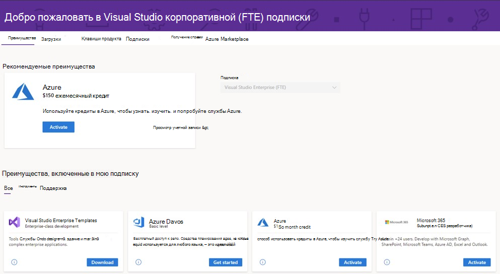

# Присоединяйтесь к программе для разработчиков Microsoft 365 через подписку на Visual Studio Professional или Enterprise

Все новые участники программы для разработчиков Microsoft 365 (в том числе подписчики Visual Studio Professional и Enterprise) могут получить подписку на Microsoft 365 E5 для разработчиков (Windows не включена). 

В некоторые стандартные подписки Visual Studio Professional или Enterprise входит также льготный доступ к подписке разработчика Microsoft 365, пока подписки активны. Платные подписки на Visual Studio Professional или Enterprise дают также бесплатную возобновляемую подписку разработчика Microsoft 365 (число пользователей - до 25). Это может быть полезно, если вы хотите создать собственную песочницу вне корпоративного домена для разработки и тестирования.

Вы также получите особый статус в программе для разработчиков Microsoft 365. Ваша подписка будет продлеваться автоматически, пока у вас есть действительная подписка на Visual Studio Professional или Enterprise.

## Как получить возобновляемую подписку разработчика Microsoft 365?

Если у вас нет подписки на Visual Studio Professional или Enterprise и вы хотите ее получить, см. страницу [Подписка Visual Studio](https://visualstudio.microsoft.com/vs/pricing/).

Если у вас уже есть подписка на Visual Studio Enterprise или Visual Studio Professional, вы можете получить льготную подписку разработчика Microsoft 365 на портале для подписчиков Visual Studio. Перейдите в [https://my.visualstudio.com](https://my.visualstudio.com) и щелкните плитку **подписки разработчика Microsoft 365 (E5)**, и вы автоматически присоединитесь к программе для разработчиков Microsoft 365 с помощью своего ИД Visual Studio.

## В чем разница между непосредственным присоединением к программе и присоединением через подписку на Visual Studio?

Если вы присоединитесь к программе для разработчиков Microsoft 365 через подписку на Visual Studio, ваша подписка на песочницу для разработчиков Microsoft 365 E5 будет автоматически продлеваться на весь срок действия вашей подписки на Visual Studio. 

Если вы присоединитесь к программе для разработчиков напрямую, ваша подписка на песочницу для разработчиков Microsoft 365 E5 будет продлеваться каждые 90 дней в зависимости от активности вашей разработки. Дополнительные сведения см. в статье [Окончание и продление срока действия подписки](subscription-expiration-and-renewal.md).