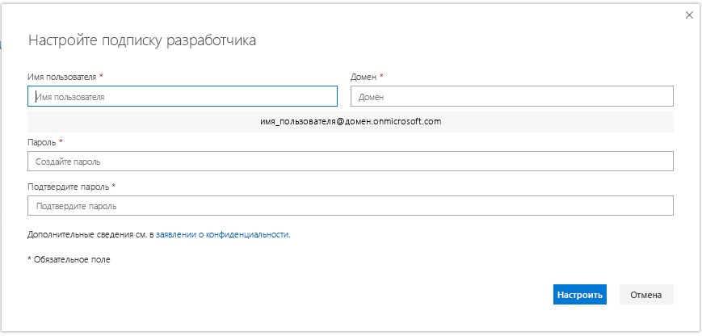

# Настройка подписки на песочницу для разработчиков Microsoft 365Set up a Microsoft 365 developer sandbox subscription 

Настройте подписку разработчика Microsoft 365 для создания решений независимо от рабочей среды.Set up a Microsoft 365 developer subscription to build your solutions independent of your production environment. Это подписка Microsoft 365 E5 для разработчиков с 25 пользовательскими лицензиями.The subscription is a Microsoft 365 E5 Developer subscription with 25 user licenses. Она действует в течение 90 дней и бесплатна для использования только в целях разработки (решения для написания кода).It lasts for 90 days and is free to use for development purposes (coding solutions) only. 

> [!NOTE] 
> Чтобы настроить подписку, необходимо сначала [присоединиться к программе для разработчиков Microsoft 365](microsoft-365-developer-program.md) непосредственно или через Visual Studio Professional или Enterprise (если у вас есть подписка).To set up a subscription, you must first [join the Microsoft 365 Developer Program](microsoft-365-developer-program.md) directly or through Visual Studio Profressional or Enterprise (if you're a subscriber). После присоединения вы увидите возможность настройки подписки.After joining, you'll see the option to set up a subscription.

## Настройте подписку Microsoft 365 E5 на песочницу для разработчиковSet up your Microsoft 365 E5 sandbox subscription

1. Чтобы получить подписку разработчика Microsoft 365, на странице профиля нажмите **Настроить подписку**.To get a Microsoft 365 developer subscription, on your profile page, choose **Set up subscription**.

2. В диалоговом окне **Настройте подписку разработчика** создайте имя пользователя и домен.In the **Set up your developer subscription** dialog box, create a username and domain. Эта учетная запись будет обладать разрешениями глобального администратора для подписки.This account will have global administrator permissions for the subscription. Вы можете выбрать любое имя пользователя или домена, если оно еще не используется.You can choose any username or domain name as long as it is not already in use. Не используйте пробелы.Do not use spaces.

  

3. Создайте и подтвердите пароль.Create and confirm a password.

4. Нажмите кнопку **Настроить**.Choose **Set up**.

5. Если вам будет предложено подтвердить, что вы не робот, следуйте инструкциям и нажмите кнопку **Подтвердить**.If you are asked to prove that you're not a robot, follow the instructions, and then choose **Verify**.

6. После создания подписки ее имя и срок действия отобразятся на странице профиля.After the subscription is created, your subscription name and expiration date appear on your profile page.

  > [!IMPORTANT]
  > Запишите имя пользователя и пароль, поскольку они потребуются для доступа к подписке разработчика.Make a note of your username and password because you'll need it to access your developer subscription.

## Настройка подпискиConfigure the subscription

1. На странице профиля выберите команду **Перейти к подписке** и выполните вход с помощью своего идентификатора пользователя (например, username@domain.onmicrosoft.com) и пароля, указанных для подписки разработчика.On your profile page, choose **Go to subscription** and sign in with your user ID (for example, username@domain.onmicrosoft.com) and the password that you specified for your developer subscription.

   > [!NOTE] 
   > Не входите в подписку с использованием идентификатора учетной записи программы для разработчиков.Do not sign in to your subscription with your Developer Program account ID.

2. Используйте средство запуска приложений, чтобы перейти в [Центр администрирования](https://admin.microsoft.com/AdminPortal/Home#/homepage).Use the app launcher to go to the [Admin center](https://admin.microsoft.com/AdminPortal/Home#/homepage).

3. На домашней странице Центра администрирования нажмите кнопку **Настройка**.On the Admin center home page, choose **Go to setup**. Откроется страница **Установка Microsoft 365 E5 для разработчиков**.This takes you to the **Microsoft 365 E5 Developer Setup** page.

4. **Настройте персональные данные входа и электронной почты**.**Personalize your sign-in and email**. Вы можете подключить свою подписку к домену или использовать существующий поддомен, который вы создали.You can connect your subscription to a domain, or just use the existing subdomain that you created. После завершения выберите пункт **Далее**.When ready, choose **Next**.

5. **Добавьте новых пользователей**.**Add new users**. Вы можете добавить вымышленных или реальных пользователей для помощи в разработке.You can add fictitious or real users to help you with development. После завершения выберите пункт **Далее**.When ready, choose **Next**.
    
  > [!NOTE]
  > После настройки подписки вы можете установить пример пакета данных "Пользователи".After you set up your subscription, you can install the Users sample data pack. Пример пакета данных "Пользователи" создает в вашей подписке 16 вымышленных пользователей и добавляет лицензии, а также почтовые ящики, имена, метаданные и фотографии для каждого пользователя.The Users sample data pack creates 16 fictitious users on your subscription, and includes the licenses for each user, and mailboxes, names, metadata, and photos for each. Подробности см. в статье [Установка примеров пакетов данных](install-sample-packs.md).For details, see [Install sample data packs](install-sample-packs.md).

6. **Назначьте лицензии нелицензированным пользователям**.**Assign licenses to unlicensed users**. Предоставьте лицензии всем пользователям, которым нужна возможность работы с этой подпиской.For any users that you want to be able to work with the subscription, grant them a license. После завершения выберите пункт **Далее**.When ready, choose **Next**.

7. **Отправьте учетные данные для входа**.**Share sign-in credentials**. Всем настоящим пользователям с доступом к подписке нужно отправить их учетные данные для входа.For any real users that will access the subscription, you must share their sign-in credentials with them. Можно выбрать способ отправки, например электронную почту, скачивание или печать.You can choose a method, such as email, download, or print. После завершения выберите пункт **Далее**.When ready, choose **Next**.

8. **Установите приложения Office**.**Install your Office apps**. Вы можете установить приложения Office на свой компьютер.You have the option of installing Office apps to your computer. После завершения выберите пункт **Далее**.When ready, choose **Next**.

   > [!TIP] 
   > При последующих посещениях панели мониторинга выполните вход с помощью своей учетной записи *username@domain*.onmicrosoft.com прежде чем перейти к панели мониторинга.On subsequent visits to the Dashboard, sign in with your *username@domain*.onmicrosoft.com account before you go to the Dashboard.

9. **Вы достигли завершения настройки**.**You've reached the end of setup**. Вы завершили настройку своей подписки.You've completed the setup for your subscription. Вы можете оценить процесс при желании.You can optionally rate the experience. После завершения **перейдите в Центр администрирования**.When ready, choose **Go to the Admin center**.
    
   > [!NOTE] 
   > В настоящее время регионом по умолчанию для подписки является Северная Америка, независимо от страны или региона, в котором вы находитесь.At this time, the subscription's region defaults to North America regardless of which country/region you are in. Вы можете продолжать настройку и использование подписки разработчика.You can still proceed with setting up and using your developer subscription.

## Подготовка служб Microsoft 365Provision Microsoft 365 services

Внутренним службам, таким как SharePoint и Exchange, может потребоваться некоторое время для подготовки к подписке.It will take some time for the backend services, such as SharePoint and Exchange, to provision for the subscription. На этом этапе некоторые значки в средстве запуска приложений и на домашней странице отображаются как **Настройка (это приложение по-прежнему настраивается)**.During this step, some of the icons in the app launcher and on the Home page show as **Setting up (This app is still being set up)**. Это займет не более часа.This will take no longer than an hour.

После завершения подготовки новую подписку на Microsoft 365 можно использовать для разработки.When the provisioning is complete, you can use the new Microsoft 365 subscription for development. Срок действия подписки истекает через 90 дней.The subscription expires after 90 days. Чтобы продлить его, см. раздел [Когда срок действия моей подписки будет истекать, смогу ли я его продлить?](microsoft-365-developer-program-faq.md#renew-subscription)To extend it, see [When my subscription is about to expire, can I extend it?](microsoft-365-developer-program-faq.md#renew-subscription).

Также рекомендуется включить варианты получения выпусков, чтобы обеспечить скорейший доступ к новейшим возможностям Microsoft 365.We also recommend that you enable release options to ensure that you get access to the latest Microsoft 365 features as soon as possible. Дополнительные сведения см. в статье [Настройка вариантов стандартного или целевого получения выпусков](https://support.office.com/article/set-up-the-standard-or-targeted-release-options-in-office-365-3b3adfa4-1777-4ff0-b606-fb8732101f47).For more information, see [Set up the Standard or Targeted release options](https://support.office.com/article/set-up-the-standard-or-targeted-release-options-in-office-365-3b3adfa4-1777-4ff0-b606-fb8732101f47).

## Настройка учетной записи Microsoft AzureSet up a Microsoft Azure account

Для некоторых решений Office может потребоваться учетная запись Microsoft Azure, чтобы обеспечивать создание с помощью служб Azure.For some Office solutions, you might need a Microsoft Azure account to build using Azure services. Чтобы настроить бесплатную учетную запись Azure, см. раздел [Создайте бесплатную учетную запись Azure уже сегодня](https://azure.microsoft.com/free/).To set up a free Azure account, see [Create your Azure free account today](https://azure.microsoft.com/free/).

## Установка примеров пакетов данныхInstall sample data packs

Вы можете установить примеры пакетов данных в подписке программы для разработчиков Microsoft 365.You can install sample data packs on your Microsoft 365 Developer Program subscription. Примеры пакетов данных позволяют экономить время, автоматически устанавливая данные и содержимое, необходимые для создания и тестирования решений.Sample data packs save you time by automatically installing data and content you need to build and test your solutions. Сюда относятся вымышленные пользователи, метаданные и фотографии для имитации небольшой корпоративной среды.This includes fictitious users, metadata, and photos to simulate a small corporate environment. Дополнительные сведения о доступных примерах пакетов данных и их установке см. в статье [Установка примеров пакетов данных](install-sample-packs.md).For details about the sample data packs that are available and how to install them, see [Install sample data packs](install-sample-packs.md).

## См. такжеSee also

- [Присоединяйтесь к программе для разработчиков Microsoft 365Join the Microsoft 365 Developer Program](microsoft-365-developer-program.md)
- [Создание решений для Microsoft 365 с помощью подпискиUse your subscription to build Microsoft 365 solutions](build-microsoft-365-solutions.md)
- [Продление подписки с истекающим сроком действияRenew an expiring subscription](subscription-expiration-and-renewal.md)
- [Вопросы и ответы о программе для разработчиков Microsoft 365Microsoft 365 Developer Program FAQ](microsoft-365-developer-program-faq.md)
